# Activity Tracker - Project Architecture

Multi-activity gamification platform for life tracking.

## System Design

```mermaid
graph TB
    User["👤 User Profile<br/>id, name, photo, preferences"]

    Activities["🎯 Activities System<br/>(Extensible)"]
    Running["🏃 Running"]
    Reading["📚 Reading"]
    Meditation["🧘 Meditation"]
    Future["+ Future Activities"]

    GoalTypes["📋 Goal Types<br/>(Per Activity)"]
    RunDistance["Distance Goal<br/>(500km by Dec)"]
    RunFrequency["Frequency Goal<br/>(5x/week)"]
    RunRace["Race Goal<br/>(10km < 50min)"]
    ReadTime["Time Goal<br/>(10h/month)"]
    ReadBook["Book Completion<br/>(Finish BookXYZ)"]

    Trackers["🔄 Automated Trackers<br/>(Pluggable)"]
    HealthConnect["Health Connect<br/>(Strava → Running)"]
    GoodReads["GoodReads API<br/>(Reading)"]
    SpotifyAPI["Spotify/APIs<br/>(Future)"]
    Manual["Manual Entry<br/>(Fallback)"]

    Database["💾 Database<br/>(SQLite v6+)"]
    Users["users table"]
    Activities_DB["activities table"]
    Goals["goals table<br/>(flexible params)"]
    Runs["runs table"]
    Books["books table"]
    Entries["entries table"]

    Dashboard["📊 Dashboard<br/>(Real-time Stats)"]
    CurrentStats["Current Objectives<br/>Progress % | Streaks"]
    Insights["Insights<br/>Days without X | Alerts"]
    Gamification["🏆 Gamification<br/>Badges | Achievements"]

    Providers["⚡ Riverpod Providers"]
    UserProvider["userProvider"]
    ActivityProvider["activityProvider"]
    GoalProvider["goalProvider<br/>(Activity-aware)"]
    TrackerProvider["trackerProvider<br/>(Auto-sync)"]
    StatsProvider["statsProvider<br/>(Real-time)"]
    GamificationProvider["gamificationProvider"]

    Screens["📱 UI Screens"]
    ProfileScreen["Profile Screen"]
    ActivitiesScreen["Activities Screen<br/>(Browse/Create)"]
    GoalsScreen["Goals Screen<br/>(Per Activity)"]
    DashboardScreen["Dashboard Screen<br/>(Stats Hub)"]
    AchievementsScreen["Achievements Screen"]

    User --> Activities
    User --> Dashboard
    User --> Gamification

    Activities --> Running
    Activities --> Reading
    Activities --> Meditation
    Activities --> Future

    Running --> GoalTypes
    Reading --> GoalTypes
    GoalTypes --> RunDistance
    GoalTypes --> RunFrequency
    GoalTypes --> RunRace
    GoalTypes --> ReadTime
    GoalTypes --> ReadBook

    Running --> Trackers
    Reading --> Trackers
    Trackers --> HealthConnect
    Trackers --> GoodReads
    Trackers --> SpotifyAPI
    Trackers --> Manual

    Trackers --> Database
    Database --> Users
    Database --> Activities_DB
    Database --> Goals
    Database --> Runs
    Database --> Books
    Database --> Entries

    Database --> Providers
    Providers --> UserProvider
    Providers --> ActivityProvider
    Providers --> GoalProvider
    Providers --> TrackerProvider
    Providers --> StatsProvider
    Providers --> GamificationProvider

    Providers --> Screens
    Screens --> ProfileScreen
    Screens --> ActivitiesScreen
    Screens --> GoalsScreen
    Screens --> DashboardScreen
    Screens --> AchievementsScreen

    Dashboard --> CurrentStats
    Dashboard --> Insights
    Dashboard --> Gamification
    Gamification --> GamificationProvider

    style User fill:#4A90E2
    style Activities fill:#7ED321
    style GoalTypes fill:#F5A623
    style Trackers fill:#BD10E0
    style Database fill:#50E3C2
    style Dashboard fill:#B8E986
    style Gamification fill:#FF6B6B
    style Providers fill:#9013FE
    style Screens fill:#417505
```

## Overview

### Core Layers

**1. User Profile** - Central hub connecting all activities and stats

**2. Activities System** - Extensible multi-activity framework

- Running, Reading, Meditation, [future activities]

**3. Goal Types** - Flexible objectives per activity

- Distance Goal, Frequency Goal, Race Goal, Time Goal, Completion Goal
- Parametrized for extensibility

**4. Automated Trackers** - Pluggable data integration

- Health Connect (Strava)
- External APIs (GoodReads, Spotify, etc.)
- Manual entry fallback

**5. Database** - SQLite with flexible schema

- Support for multiple activity types
- Extensible params for goals

**6. Riverpod State Management** - Activity-aware providers

- Real-time updates
- Pluggable tracker sync

**7. Dashboard** - Real-time stats hub

- Progress tracking
- Insights & streaks
- Gamification (badges, achievements)

**8. UI Screens** - Multi-screen interface

- Profile, Activities, Goals, Dashboard, Achievements
